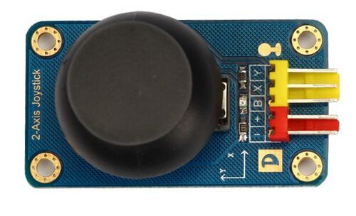
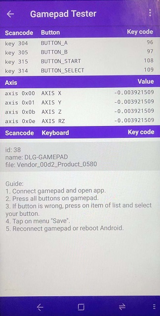
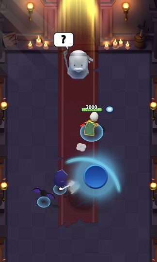
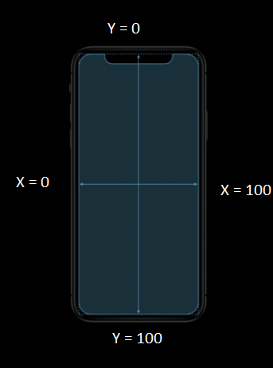

# HID Gamepad Demo

## Example Overview

A DA14585/6 HID gamepad demo project. Used to demonstrate the usage of HID features over BLE with HOGPD profile.

## Example Feature

- Standard HID gamepad over HOGPD, works with Android devices and Windows 10 PC with Bluetooth 4.2+
- Alternative HID digitizer mode(mainly for iOS devices) over HOGPD, works will all platforms with Bluetooth 4.2+
- 2 Joysticks over 4 ADC channels, 4 buttons over GPIO wakeup adapter. Capable to play games with simple control scheme
- Configurable Joystick sensitivity and button screen touch mapping through custom BLE profile (for digitizer mode only)
- Movement joystick and camera joystick implementation based on the digitizer control scheme

	
## HW and SW configuration

* **Hardware configuration**

Required components:
- DA145xxDEVKT-P PRO-Motherboard, with DA1458x daughter board QFN40/48. Or a DA14531 daughterboard, the module board does not have enough pins for this example.

The user manual for the development kits can be found:
- [here](https://www.dialog-semiconductor.com/products/da14531-development-kit-pro) for the DA145xxDEVKT-P PRO-Motherboard.

- 2-axis analog joystick with push button * 2

- Wire Connection for DA14585 and DA14586:
	- Joystick 1 (Regard as left stick, or **LS** in the code):
		- Power supply - VBAT
		- Ground - GND
		- X axis - P0_0
		- Y axis - P0_1
		- Push Button - P2_0 (set for button "A", active HIGH)

	- Joystick 2 (Regard as right stick, or **RS** in the code):
		- Power supply - VBAT(or V_FLASH_SUPPLY)
		- Ground - GND
		- X axis - P0_2
		- Y axis - P0_3
		- Push Button - P2_1 (set for button "B", active HIGH)
	
	- Buttons:
		- put jumper J10 to enable buttons on the dev kit mother board
		- SW2 - P0_6 (set for button "Select", active LOW)
		- SW3 - P1_1 (set for button "Start", active LOW)
		
- Wire Connection for DA14531:
	- Joystick 1 (Regard as left stick, or **LS** in the code):
		- Power supply - VBAT
		- Ground - GND
		- X axis - P0_1
		- Y axis - P0_6
		- Push Button - P0_3 (set for button "A", active HIGH)

	- Joystick 2 (Regard as right stick, or **RS** in the code):
		- Power supply - VBAT
		- Ground - GND
		- X axis - P0_2 or not connected, based on DEBUGGING flag
		- Y axis - P0_7
		- Push Button - P0_4 (set for button "B", active HIGH)
	
	- Buttons:
		- SW - P0_9 (set for button "Select", active LOW)
		- SW3 - P0_11 (set for button "Start", active LOW)
		
- If the joystick module is not available, make sure to set **CFG_USE_JOYSTICKS** to 0 in order to disable related codes and prevent the device sending funny HID reports
- One of the four ADC channels is shared with the SWD debugging. Therefore there is a flag added in user_periph_setup.h un-defining this flag will enable the fourth channel, but debugging will be impossible. 

* **Software configuration**

	- This example requires:
		* Keil uVision 5
		* 6.0.14.1114 (https://www.dialog-semiconductor.com/da14531_sdk_latest)
		- **SEGGER’s J-Link** driver installed

## How to run the example

### Initial Setup

For iOS devices, search for global define **CFG_USE_DIGITIZER**, change its value from "0" to "1". Doing this will configure the device as an HID digitizer that able to work with iOS devces. Otherwise the device will work as standard gamepad.

For the initial setup of the project that involves linking the SDK to this SW example, please follow the Readme [here](https://github.com/dialog-semiconductor/BLE_SDK6_examples).

### Function Test

* **Test with Android APP**

	- Search and connect to device "DLG-Gamepad" in the system setting->Bluetooth page
	- After pairing, one should be able to use joystick 1 to navigate through the menu, and use button "A" to enter, "B" for back
	- An app called [Gamepad Tester](https://play.google.com/store/apps/details?id=ru.elron.gamepadtester&hl=en_US) could be used to explore more detailed HID reports info of the device, downloadable from Google Play Store
	- To disconnect, remove the paired device from the system bluetooth device info page
	

* **Test with Windows 10 PC**

	- Go to windows settings -> Devices -> Bluetooth & other devices settings page (Make sure the PC model has BT4.2 compatible Bluetooth module equipped)
	- Click "Add Bluetooth or other device" -> Bluetooth, scan and connect to device "DLG-Gamepad"
	- Wait for the device connect, pair, and system will automatically install general gamepad driver
	- Test the device with any PC game that supports general gamepad, do note that you may need to rebind the button map for some games.
	- [This site](https://html5gamepad.com/) can also be used to check with incoming gamepad hid reports

* **Test with iOS devices**

	- Make sure configure the example as HID digitizer mode by setting **CFG_USE_DIGITIZER** to 1
	- **In Bluetooth setting page from iOS system settings**, scan and connect to device "DLG-Gamepad"
	- Click "OK" when a pairing request window pops out
	- Use test app like [Test Multitouch](https://apps.apple.com/us/app/test-device-multitouch/id1143529785) to check control scheme of both joysticks and location of 4 buttons
	- Try game control for games with simple control scheme (e.g. Arch hero)
	- 
* **Digitizer mapping configurations**
	- The screen was mapped as below with 2 axis, X and Y from 0 to 100
	- 
	- By default, the key mappings are defined in **user_gamepad.h**, however, this can be lively configured to fit different game controls
	- Connect to the device with BLE debugger app like LightBlue to change the mapping by sending 16 byte hex numbers:
		- **byte 1 - 8**: 4 pairs of {X,Y} mapping for button **A, B**, **Select** and **Start**. From 0 to 100 (0x64)
		- **byte 9 - 16**: 2 pairs of {X center, Y center, radius, velocity}
		- X center and Y center defines the starter point for the direction control
		- Radius is the reach distance of the **LS**, only used by **LS**. Should not larger than closest distance from center point to a screen side (out of 100)
		- Velocity is the movement speed multiplyer of controlling **RS**. Should not larger than 100
		- LS and RS works in a different manner, where LS moves the touch point within a circle(or square in this case), RS moves the touch point all over screen range
	- sending anything else (not 16 bytes long) will reset the configurations to the default stage
	- When the joystick not pushed to any direction (both X and Y axis ADC samples close to a middle point), the HID reports will not be sending, this is called the **Deadzone** of a joystick, and the range of deadzone is configurable with 

## Software Info

* **user_peripheral.c**
	- Main application

* **user_gamepad.c**
	- Joystick function implementations
		- Button registration and detection
		- Joystick position polling and calculations
		
* **user_gamepad.c**
	- All important joystick configurations
		- HID device mode
		- Joystick position update rate
		- Default key mapping
		- ADC adjustment
		- Joystick deadzone adjustment
	
* **user_hogpd_config.h**
	- HID report and report map configurations
	
* **app_hogpd.c** and **app_hogpd_task.c**
	- HID profile application messages and handling
	

## Known Limitations

- For iOS digitizer mode, currently multi-touch is not supported due to only 1 HID instance was implemented
- Joystick control is not round up as a circle, but a square due to simpler calculation method
- You can check and refer to the following 
  application note for known hardware limitations.
  [DA14585 hardware limitations](https://www.dialog-semiconductor.com/sites/default/files/da1458x-knownlimitations_2019_01_07.pdf)
- Dialog Software [Forum Link](https://support.dialog-semiconductor.com/forums/dialog-smartbond-bluetooth-low-energy-%E2%80%93-software "Forum Link").

