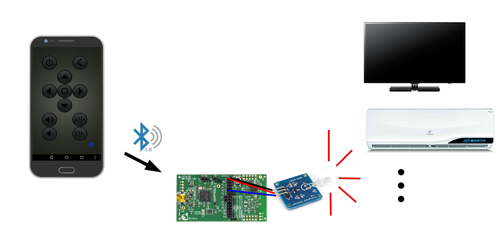
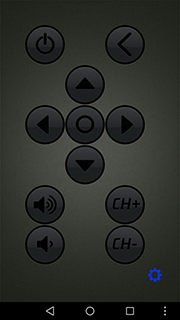

# IR Remote Demo

---

## Example description

This program takes an incoming command from a connected mobile phone, encodes it into a standard infrared control signal and sends it out via a normal IR emitter. 
	
A basic IR encoding driver was implemented so that user can add customized protocols based on it. With a valid IR remote commands library and proper configurations, this demo can be used as an universal IR remote controller which is able to control most legacy home devices.

An Android app which works with the demo is provided to test the commands, and can be actually used as a remote controller for selected devices.

	
## HW and SW configuration

* **Hardware configuration**

	- This example runs on The DA14585/DA14586 Bluetooth Smart SoC devices. (Could be easily migrate to DA14580/DA14583.)
	- The USB Development kit is needed for this example, both Basic and Pro versions are supported.
	- An IR emitter is required for the demo to work.
		- For 2 pin emitter(Not tested):
			- Connect ground pin to ground pin on the devkit
			- Connect power pin to P02 on the devkit
		- For 3 pin emitter:
			- Connect ground pin to ground pin on the devkit
			- Connect power pin to VBAT pin on the devkit
			- Connect signal pin to P02 on the devkit
	- [Open Smart IR-emitter](https://www.dx.com/p/produino-ir-transmitter-module-for-arduino-blue-works-with-official-arduino-boards-288657) was used for test, but any other simple IR emitter should all work fine. This emitter works with 3~5V supply, it did not perform well(<2m effective range)
	- Connect the USB Development kit to the host computer
	- If no IR emitters are available, a signal analyzer on P0_2 can be used to verify the signal

* **Software configuration**

	- This example requires:
    * Keil uVision 5
    * SDK6.0.10.511
	- **SEGGER’s J-Link** tools should be downloaded and installed.

## How to run the example

### Initial Setup

Nothing needs to be changed or configured by default, just put the project folder under 6.0.10.511\projects\target_apps\ble_examples, build and run as any other example project.

### Function Test

Note: The BLE program is just a tool to convert hex commands into IR conrol signals, there is no IR command library included in this demo or Android application, it only works on a home devce when you know the valid command set, and the protocol is supported by the program. Check the lists below for reference.

- Currently supported IR protocols:
	- Philips RC5
	- NEC
	- Samsung
	- Panasonic

- Tested device:
	- ZTE IPTV Box B860A (NEC protocol)
	- Samsung TV (Samsung protocol)
	- Panasonic Projector X416C

* **Test with Android APP**

	- Install and run the "IR Remote" app. in the Android folder, agree if any permission requests pops up. In Android 6.0+ the Google Android API update resulted Bluetooth LE technology requires location permissions to be granted in order to use the app.
	- The app will try to find and connect to "DLG-Remote" device by its BD address on launch. Check if the device is properlly advertising or if the BD address is altered when the app keeps looking for the device.

	

	- After successfully connecting to the device, press any button to send corresponding commands.
	- By default, the controller screen would be configured for ZTE IPTV box, tap on the blue gear at bottom right corner to enter the editor

	

	 

	- Commands are essentially stored as profiles for different devices for simplicity, no device categories or brand lists for current version. (Plan to be added in the future)
	- To load another profile, click the profiles button at top left to select. By default only 2 devices are available.
	- To create a new custom profile, click the plus icon at the top right corner
	- Provide a device name, select proper protocol, input device address code and commands as heximal strings in corresponding fields. Hit save button down below to save and load the profile.
	- The 2 default profiles are not editable nor deletable.
- The Andriod app was made with MIT [App inventor 2](http://ai2.appinventor.mit.edu). The "source" form of the app is also available in the folder as the .aia file, which can be imported into app inventor for modification or further development.

* **Test without Android APP**

	- Use any BLE debug app for the test when you don't have an Android phone or are not willing to install the app. (e.g. LightBlue)
	- Scan and connect to device "DLG-Remote"
	- Go to the unknown service UUID starting with EDFEC62E...
	- Write commands as unsigned bytes to the only characteristic described as "Long Value"
	- A unsigned integer(in hex) array is expected, with rules as below appied:
		- The first byte is protocol picker, should be:
			- 01 - NEC
			- 02 - RC5
			- 03 - Samsung
			- 04 - Panasonic
			- FF - Custom
		- The following bytes are input parameters for each protocols. Most of them require 2 bytes(address, command), while Panasonic protocol uses more bytes. The rule can be modified in the protocol function and the BLE write handler.
		- Input with length less than 3 bytes or started with unhandled protocol value would not trigger any IR activity.
		- For custom commands, see next part for the explanations. 

### Adding protocols/Modify the driver

Users can add custom protocols or modify the driver for their own needs. Please refer to instruction below to understand how the encoding works.

- Drivers and protocols
  
  - All IR encoding related code resides in src/user_driver/user_IR_driver.c and its header file.
  - IR remote signals are essentially a sequence of 0 and 1s represented by on/off states of a pulsing IR light. The pulse has a specific frequcency and duty cycle. 
  - Function **ir_send_sequence** is the core function to generate IR signal out of given logic sequence based on timer0 and PWM functionalities. It has 4 input augments:
  	1. struct pwm_settings *freq*: Consits of 2 unsigned 16bit value, *pwm_high* and *pwm_low*.
		- Signal carrier frequency can be calculated as $\frac{16M}{pwm_{high}+pwm_{low}+1}$.
		- Signal carrier duty cycle can be calculated as $\frac{pwm_{high}}{pwm_{high}+pwm_{low}+1}$. 
		- For example, PWM setting of {138,280} results signal carrier of ~38KHz, and a duty cycle of ~33%. 
		- Common carrier frequecy settings (38KHz and 36KHz) are pre-defined, feel free to use or modify the value as own preference.
	2. uint16_t *width*: The duration in 16M XTAL ticks for the smallest signal block of a given protocol. 
		- Duration of a signal "block" can be calculated as $\frac{width}{16M}$.
		- The actual duration may be slightly different from theoretical calculation. Feel free to tailor the value with help of a logic anylizer.
	3. uint8_t *length*: The number of the signal "blocks"
	4. uint8_t* *sequence*: Pointer to the start of the signal sequence.
		- The signal sequence will be processed byte wise, starting with the start byte, from MSB to LSB in each byte. 
		- Each byte represents 8 signal "blocks", where the total number of "blocks" to be send is defined by the *length* augment
  - The  **user_XXX_send** functions are used to prepare the signal sequence to be send based on the given address and command value, where XXX represents an IR remote protocol.
	- Users can add new protocols by implementing their own functions. The unique rules of the protocols should be implemented to convert commands into signal sequences, the carrier frequencey and signal block width should also be properly calculated for the protocol.
  - Example:

	For the "power on" command of ZTE IPTV box, it uses NEC protocol with device address 0x00, command 0x02.

	NEC protocol has a leading signal of 9ms pulse on followed by 4.5 ms pulse off. After the leading signal, the actual logical sequence goes as this: 8 bit address, inverted 8 bit address, 8 bit command, inverted 8 bit command followed by an ending pulse. LSB transmitted first in this protocol.

	Logic 0 is presented as 2 blocks (on-off), Logic 1 is presented as 4 blocks(on-off-off-off), with 560us width for each block. Using 560us as a smallest unit, the leading signal can be seen as 16 blocks of pulse on and 8 blocks of pulse off.

	Thus, for NEC command 0x00, 0x40:

	
	
	The logic sequence is 
	
	**Leading signal - 00000000(address, 0x00) -  11111111(inversed address, 0xFF) - 0000010(Command, 0x40->0x02) - 11111101(inversed command, 0xfD)**

	The signal bit sequence is 
	
	**11111111 11111111 00000000(leading signal, 9ms on, 4.5ms off )** 
	
	**10101010 10101010 (address, 00000000)** 
	
	**10001000 10001000 10001000 10001000 (inverted address, 11111111)**

	**10101010 10100010 10 (command, 00000010)**

	**100010 00100010 00100010 10001000 (inverted command, 11111101)**

	**1 (ending pulse)**

	So the actual sequence for sending is {0xFF,FF,00,AA,AA,88,88,88,88,AA,A2,A2,22,22,88,80}, with length 121 in bits.

  - Custom protocol:

	When write command starts with 0xFF to the BLE character, the byte sequence will be directly send out without any translation from command to signal sequence. Function **user_custom_send** simply remaps the input bytes to the input parameters of the signal output function.

	- Byte 1: 0xFF
	- Byte 2: PWM frequency select (01 - 38kHz, 02 - 36kHz, 03 - 37kHz)
	- Byte 3~4: Signal block width
	- Byte 5: Signal length in bit
	- Byte 6: Gap length before repeat
	- Byte 7~: Start of actual signal sequence

### Modify the command

- As explained, the program receives a byte array and correspondingly encodes it to a proper IR control signal sequence. The message handling is done in function 
**user_svc1_long_val_wr_ind_handler** in user_custs1_impl.c, which implements the handlers of the custom1 profile.
- Users can add switch case for new custom protocols or re-define what to do with received data on the characteristics on own preference.
## Known Limitations

- The program is not capable to "learn" new commands from existing remotes for now.
- Android app UI may not scale correctly on some mobile phones.
- Signal timing is not 100% accurate as described due to calculation error or other SW/HW affects.
- [known hardware limitations](https://support.dialog-semiconductor.com/system/files/resources/DA14580-KnownLimitations_2018_02_06.pdf "known hardware limitations").
- Dialog Software [Forum Link](https://support.dialog-semiconductor.com/forums/dialog-smartbond-bluetooth-low-energy-%E2%80%93-software "Forum Link")
- you can Refer also for the Troubleshooting section in the DA1585x Getting Started with the Development Kit UM-B-049.

