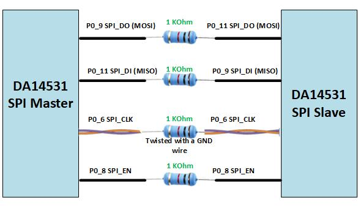
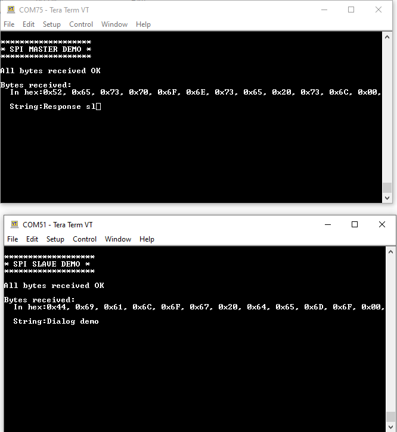
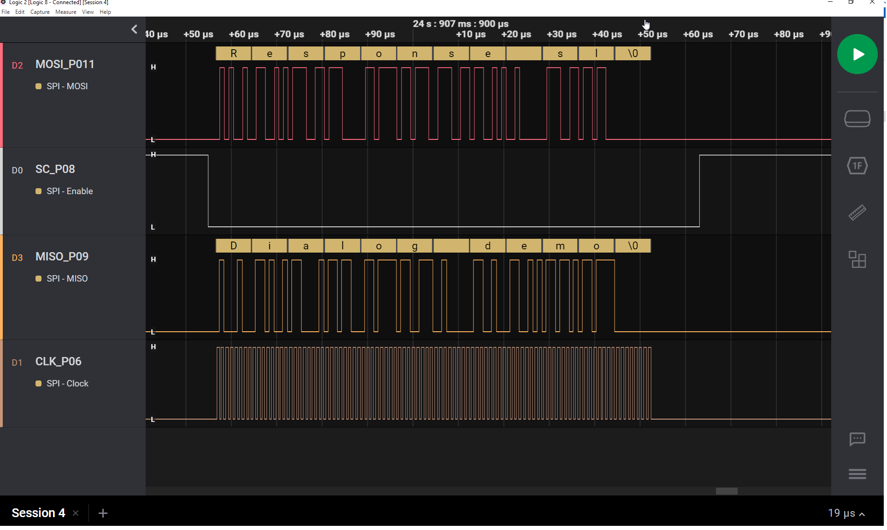

# DA14531 SPI Master Slave example
---

## Example description

This example describes how to perform SPI data buffer transmission/reception between two DA14531 devices via DMA. 
The project is split in two parts: The Master Board and the Slave Board.

## HW and SW configuration

### Hardware configuration

- This example runs on the DA14531 Bluetooth Smart SoC devices.
- Two DA145xx Pro Development Kit are needed for this example. One will act as Master, the other as slave.
- You need to make the following interconnections between the two DA145xx Pro Development Kit.
  The interconnections between the two DA145xx Pro Development Kit is giving in the `user_periph_setup.h` file, On your setup, the SPI signals (CLK, MOSI, MISO, SC) need to have a 1kOhm resistor each in series and the SPI CLK must be in a twisted-pair configuration with the GND.
- Also, on each board you must connect P05 (P25 on the J2 DA14531 Signals) to UTX pin 17 on J1 (J5.12) in order to have UART console logging.

### Software configuration

- This example requires:
    - SDK v6.0.16 or later
	- **SEGGER’s J-Link** tools should be downloaded and installed.
     
## How to run the example

For the initial setup of the project that involves linking the SDK to this SW example, please follow the Readme [here](../../Readme.md).

### Compile and run

- Run Master SPI Keil project. Run the python script to import needed files from the SDK (You can refer to the previous section)
- Under this Folder: `SPI_Master\project_environment` Open and Start Keil µVision.

- Run Slave SPI Keil project. Run the python script to import needed files from the SDK (You can refer to the previous section)
- Under this Folder: `SPI_Slave\project_environment` Open and Start Keil µVision.
- You build/download/run **first the DA14531_SLAVE** to one of the boards and then you build/download/run the DA14531_MASTER.
- You open two UART terminals for logging messages from both the master and the slave.	

### SPI Master/Slave communication

At the beginning of the main program the `system_init()` is called for system initialization. 
The SPI communication is Initialized during the peripheral initialization through the function `periph_init()` function. The `spi_transfer` function 
is called to Start sending/receiving data to/from SPI in Full Duplex mode.
The `spi_master_demo_out_buffer` and `spi_slave_demo_out_buffer`are a predefined buffers (12 bytes) with data to send/receive to/from SPI. 
The SPI master starts the communication by sending `spi_master_demo_out_buffer`  and receiving `spi_slave_demo_out_buffer`.
The callback function `spi_transfer_user_callback` is used to check the transfer status and to return in interrupt/DMA-driven transferring operations.
Finally,  

### Expected Results: UART Output

For each Board you need to Open a serial port with the following parameters.

		- baudrate: 115200
		- data: 8 bits
		- stop: 1 bit
		- parity: None
		- flow  control: none
		
 - As soon as the examples run on both boards (Slave and master) following message should appear on the terminals.

The following will be printed on the master and slave sides:

### Expected Results: Signal Outputs

## Known Limitations

- You can also refer to the [DA14531 Getting Started Guide with the PRO-Development Kit](http://lpccs-docs.renesas.com/UM-B-117-DA14531-Getting-Started-With-The-Pro-Development-Kit/index.html).
- Dialog Software [Forum link](https://community.renesas.com/wireles-connectivity/f/bluetooth-low-energy).
