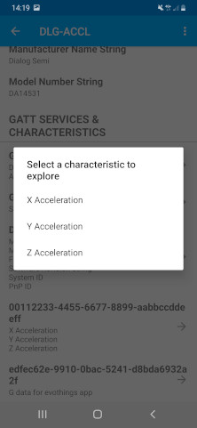
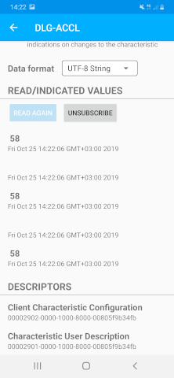
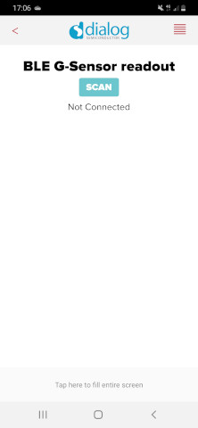
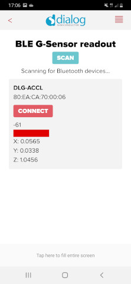
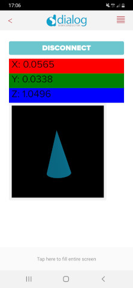

# Reading an I2C accelerometer and sending BLE notifications

---

## Example description

This example shows how to acquire data from an I2C accelerometer and send the measurements with BLE notifications using a DA14531 or DA14585/586 device. This example project also interfaces with an [Evothings](https://evothings.com) app which displays the orientation of the sensor, or you could use a BLE Scanner app to read out the measurements.

An I2C sensor is not necessary to run this example.
Defining NO_SENSOR in ``ADXL345.h`` disables reading of the sensor. 
The application will send an incrementing number over BLE in this case. 

## HW and SW configuration

### Hardware configuration

- This example runs on the DA14531 or DA14585/DA14586 Bluetooth Smart SoC devices.
- The DA145xx Pro Development Kit is needed for this example.

Follow the hardware configuration according to your daughterboard, DA14531 or DA14585/DA14586.

* **Hardware configuration for DA14531 devices**
    - Connect the USB1 connector of the DA145xx Pro Development Kit to the host computer.
    - Connect the positive rail of your breadboard to pin V3 of the development board and the negative rail to any ground pin of the development board (the ones marked with a dash). Power up the sensor by connecting the 3.3V pin of the ADXL345 to your positive rail and the GND pin of the sensor to your negative rail.
    - Tie high the SDO and CS pins of the sensor to your positive rail. This enables the sensor to operate in I2C mode and adjusts the I2C sensor address to match the one defined in the project.
    - Connect the SCL pin of the ADXL345 to pin P23 of the development board.
    - Connect the SDA pin of the ADXL345 to pin P21 of the development board.

 * **Hardware configuration for DA14585/DA14586 devices**
    - Connect the USB1 connector of the DA145xx Pro Development Kit to the host computer.
    - Connect the positive rail of your breadboard to pin V3 of the development board and the negative rail to any ground pin of the development board (the ones marked with a dash). Power up the sensor by connecting the 3.3V pin of the ADXL345 to your positive rail and the GND pin of the sensor to your negative rail.
    - Tie high the SDO and CS pins of the sensor to your positive rail. This enables the sensor to operate in I2C mode and adjusts the I2C sensor address to match the one defined in the project.
    - Connect the SCL pin of the ADXL345 to pin P13 of the development board.
    - Connect the SDA pin of the ADXL345 to pin P11 of the development board.
  
### Software configuration

- This example requires:
    - SDK v6.0.12 or later
	- **SEGGER’s J-Link** tools should be downloaded and installed.
     - An application like LightBlue Explorer should be used to act as a BLE Scanner and view the received measurement values. It can be found on [Google Play](https://play.google.com/store/apps/details?id=com.punchthrough.lightblueexplorer) or on the [App Store](https://apps.apple.com/gb/app/lightblue-explorer/id557428110).

## How to run the example

For the initial setup of the project that involves linking the SDK to this SW example, please follow the Readme [here](https://github.com/dialog-semiconductor/BLE_SDK6_examples).

### Compile and run

- Start Keil µVision.
  - Optionally, change the parameters in ADXL345.h
- Select the DA14531, DA14585 or DA14586 device in the box shown below

    

- Compile and run the project.

### Connecting to the device
- Open the BLE scanner app and look for DLG-ACCL
    
    

- Connect to the device. Lightblue will list all the available services.

    

- Select the characteristic you wish to explore, like the X acceleration data. 

    

- Subscribe to notifications and select the UTF-8 String data representation. You will be now ready to receive live the X acceleration (in milli g).
    
    

## Evothings

This example also comes with an Evothings demo application. The application can connect to the DA14531 or DA14585/DA14586 device and read out the acceleration data. There is also a 3D visualization of pitch and roll. Follow the instructions below to connect.

- Download the Evothings Viewer. At the time of writing, the Evothings Viewer is temporarily unavailable on IOS. The Android version of the app is available in the [Google Play store](https://play.google.com/store/apps/details?id=com.evothings.evothingsviewer).

- When the Evothings Viewer is started, you are able to connect to the demo project. Input the URL http://lpccs-docs.dialog-semiconductor.com/Evothing/index.html and push the "Connect" button. 

    

- When the app is loaded you can start scanning for the DA14531 or DA14585/DA14586 device.

    

-  If the device is found, the accelerometer data is shown without the device being connected.
This is possible because the accelerometer measurements are included in the manufacturer specific data of the advertising packets. 

    

- After a connection is established, the smartphone subscribes to the G-acceleration service. After this, the device will start sending data to the smartphone. You will be able to see the 3D visual change when you move around the sensor.

    

## Known Limitations

- There are no known limitations for this example. But you can check and refer to the following application note for
[known hardware limitations for DA1458x devices](https://www.dialog-semiconductor.com/sites/default/files/da1458x-knownlimitations_2019_01_07.pdf) or [known hardware limitations for DA14531 devices](https://www.dialog-semiconductor.com/da14531_HW_Limitation).
- Dialog Software [Forum link](https://www.dialog-semiconductor.com/forum).
- You can also refer to the [DA14585/DA14586 Getting Started Guide with the PRO-Development Kit](http://lpccs-docs.dialog-semiconductor.com/da14585_getting_started/index.html) or the [DA14531 Getting Started guide](https://www.dialog-semiconductor.com/da14531-getting-started).

