# Booting the DA14531 through a R7FA2E1 from RENESAS (EK-RA2E1)

---
## Example description

The DA14531 has an integrated ARM Cortex M0+ and can be used for programming and controlling the SoC. 
Due to the small form factor, the ARM Cortex has its limitations. A solution for the limitations of the integrated microprocessor can be to use an external microprocessor. 
To control the DA14531 with this microprocessor some code is still needed on the DA14531. 
Fortunately, the DA14531 can execute code from RAM that can be loaded in during its boot sequence. 
This way a microcontroller can load a program into the DA14531.

The goal of this example is to show how to load a program into the RAM of the DA14531 via a R7FA2E1 (EK-RA2E1) microcontroller. 
This example shows the flow of the code and how it can be configured. The program that is booted on the DA14531 in this example is Codeless or proximity reporter depending on the user selection in **`da14531_boot_config.h`**. 
This example does not need the SDK6, a precompiled version of theses binaries is included in the project: **`da14531_codeless_image.h`** and **`da14531_prox_reporter_image.h`**.
The interface that is used for booting is two UART. Codeless is a solution by Dialog to interface with the DA14531 with AT commands. 
More info on Codeless and its use can be found on [Codeless](https://www.dialog-semiconductor.com/products/smartbond-codeless-commands).

## HW and SW configuration

### Required hardware

- A PC workstation
- [EK-RA2E1 Evaluation Kit](https://www.renesas.com/us/en/products/microcontrollers-microprocessors/ra-cortex-m-mcus/ek-ra2e1-evaluation-kit-ra2e1-mcu-group) from Renesas.
- A DA14531 Pro Development Kit DA14531 or Clickboard [BLE TINY click](https://www.mikroe.com/ble-tiny-click).
- SEGGER J-Link® USB Serial Drivers
- [Optional] SEGGER J-Link Real-Time Transfer (RTT) Viewer, virtual terminal emulation application

### Hardware configuration using DA14531 PRO-Motherboard
- Connect the each of the two boards to the host computer, you can also power the DA14531 PRO-Motherboard through the RA2E1 by connecting the VDDs and GNDs, the RA2E1 should be connected to the HOST PC.
Connect the two boards to each other through **2 wire UART interface** as shown on the image below: 
+ On the EK-RA2E1 Mikrobus **RX** pin connected to **P20 (P0_0)** on the DA14531 PRO-Motherboard.
+ On the EK-RA2E1 Mikrobus **TX** pin connected to **P21 (P0_1)** on the DA14531 PRO-Motherboard.

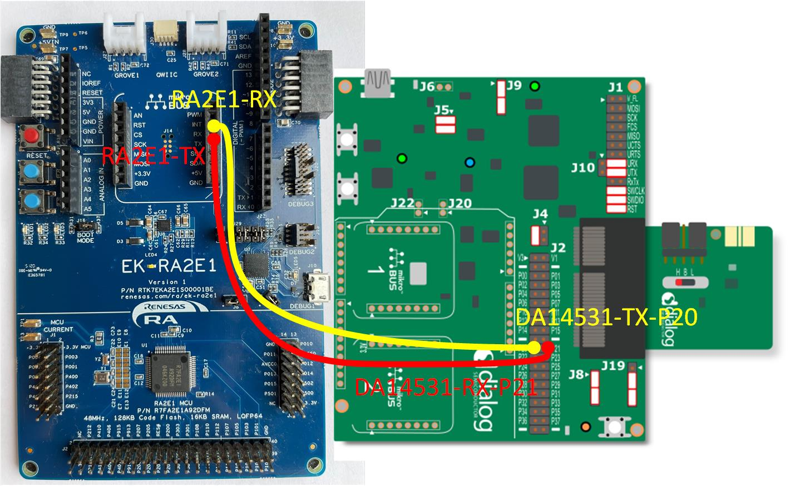

For booting using **1-wire UART** it will requires to generate RxTx single wire UART by using the internal **1Khom resistor**.
+ On the EK-RA2E1 Mikrobus **RX** pin connected to **J10-2** on the DA14531 PRO-Motherboard.
+ On the EK-RA2E1 Mikrobus **TX** pin connected to **J10-1** on the DA14531 PRO-Motherboard.
- Jumper must be applied on RxTx **J1:19-20**. 
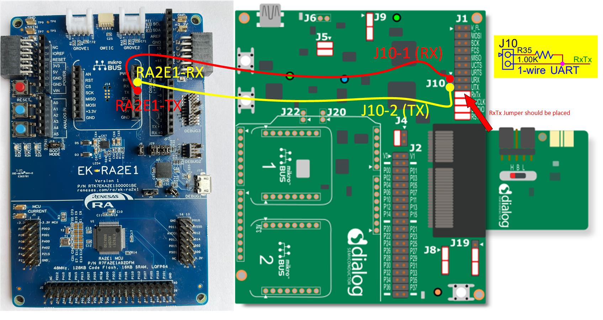

### Hardware configuration using Clickboard BLE TINY click
- Connect the micro USB end of the micro USB device cable to micro-AB USB Debug port (J10, DEBUG1) of the EK-RA2E1 board.
- Put the DA14531 Clickboard in the MikroElektronika™ mikroBUS connector slot of the RA2E1 Dev kit: J21-J22.

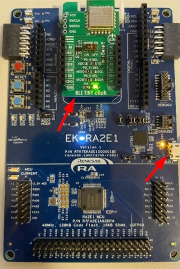
- There is some HW rework on the RA2E1 in the reset line of the MikroElektronika™ mikroBUS. The 10K pull up resistor R12 should be removed, this is because the DA14531 reset is active high.

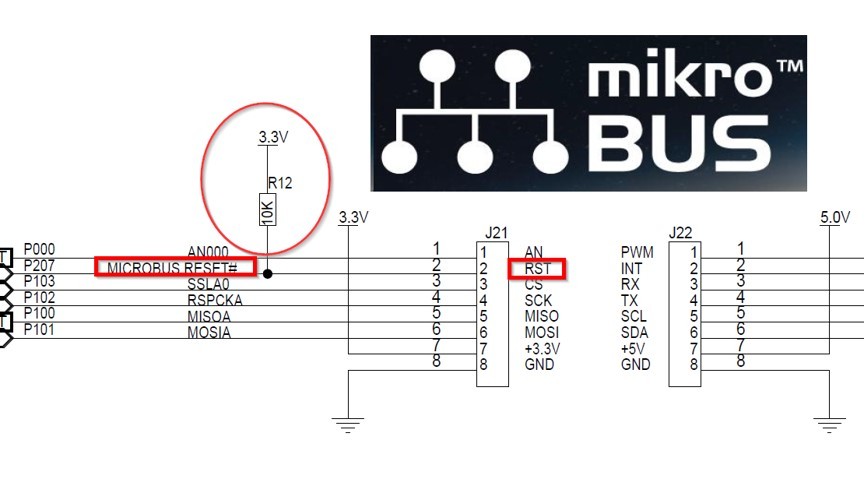

To enable to 1 Wire on the Tiny click board, Put the switch to the ON position. By default it is OFF.

### Software configuration

**Supported Toolchains:**

- Keil MDK (v5.36 or higher) and ARM compiler 6 (version 6.13 or higher) 
- Renesas e² studio IDE V21.10 or greater

**Supported Emulator Devices:**

- SEGGER J-Link tools should be downloaded and installed.

**Bluetooth® Explorer Tool**

- BLE scanner for your smartphone (in this example we are using LightBlue® Explorer (iOS))

**Renesas Flexible Software Package (FSP) Installation**

*Installing the FSP with KEIL MDK ARM*

When using a KEIL MDK ARM IDE, you can use the Renesas RA Smart Configurator to configure the software system for a Renesas RA microcontroller. 
The RA Smart Configurator (RA SC) is a desktop application designed to configure device hardware, such as clock setup and pin assignment, as well as initialization of FSP software components for a Renesas RA
To download and install the RA SC Installer, visit the [GitHub](https://github.com/renesas/fsp/releases) page of Flexible Software Package (FSP) for Renesas RA MCU Family.
Search for the RA SC installer and download it (for example, **`setup_fsp<version>_rasc_<version >.exe`**).

- Open the Keil project
- Now click on Flex Software to Manage Run-time Environment tab.

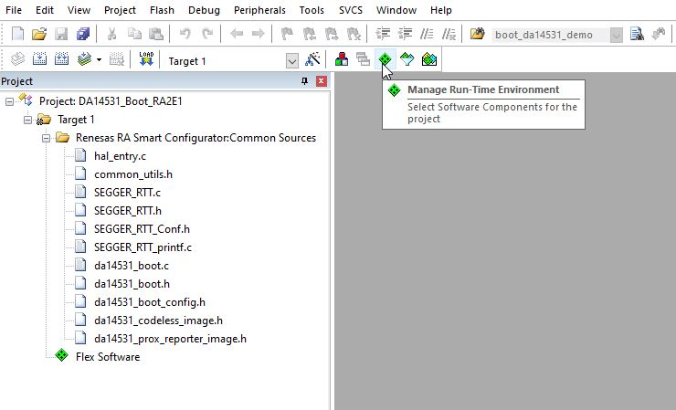

- Click the green run button next to RA Configuration in the Flex Software tree. 

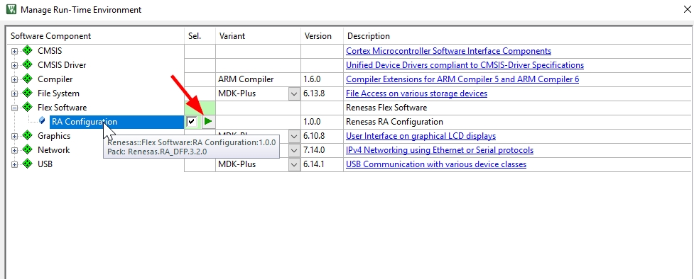

- Then the RASC will be launched with project generator wizard.

- In the RA Configuration window, click the Generate Project Content button.

**NOTE**
If the RA Smart configurator is not installed, the below message will be displayed and then it should be installed.

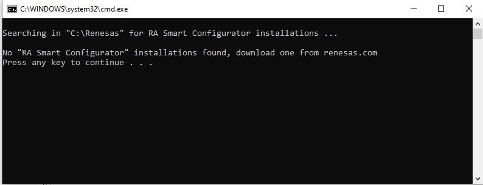

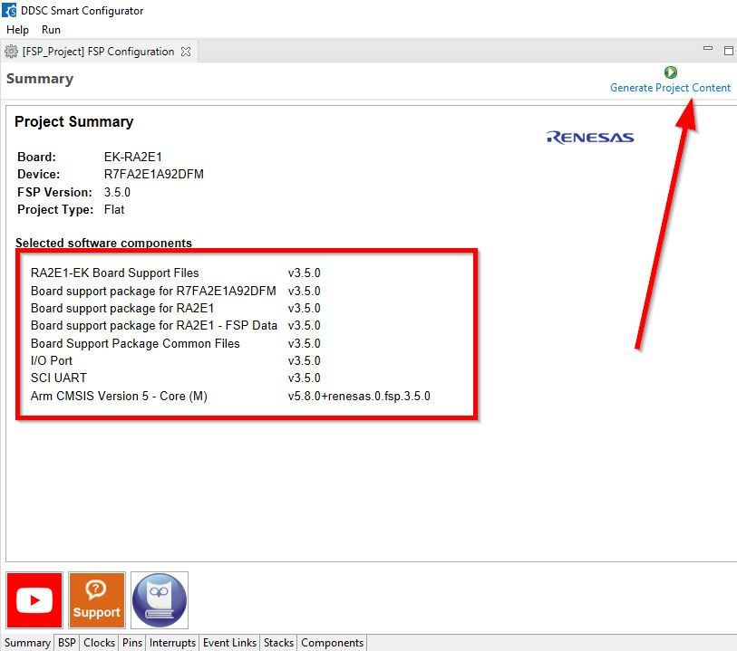

- After clicking Generate Project Content button in the RA Smart Configurator, return to KEIL μVision. 
KEIL μVision offers a dialog box to import the changes and updates to the project made in RASC. Select Yes to import the updated project and the project is ready to build.

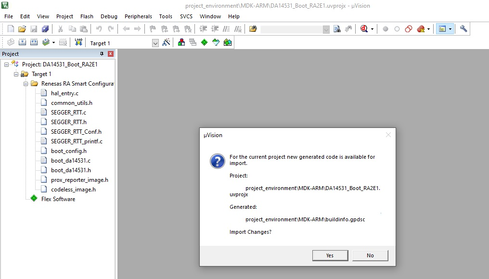

- RASC will place the necessary FSP source code and header files into the project workspace.

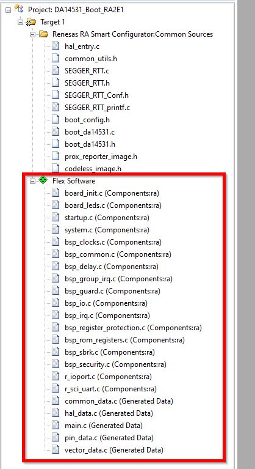

*Installing the FSP with e² studio Installer*

The FSP with e² studio Installer includes the e² studio tool. To download and install the FSP with e² studio Installer, follow the steps below:

- Visit the [GitHub](https://github.com/renesas/fsp/releases) page of Flexible Software Package (FSP) for Renesas RA MCU Family.
- Select FSP with e² studio Installer (for example, **`setup_fsp<version>_e2s_<version >.exe`**) and click the link to download directly.
- Launch e² studio 
- Open the FSP configuration and then click on Generate Project Content button to generate the source code content.

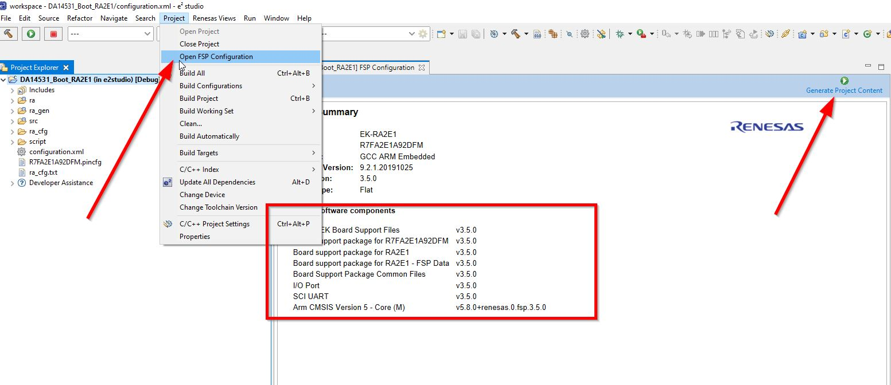

**Flow of the code**

The protocol required to establish successful communication and to download the SW image into the RAM is shown in the Table 7 **Boot Protocol** in the [AN-B-072](https://www.dialog-semiconductor.com/an-072-booting-from-serial-interface).
The protocol starts with the DA14531 UART TX pin that transmits 0x02 (Start TX - STX). 
The R7FA2E1 MCU is expected to answer with a 0x01 (Start of Header - SOH) byte followed by 2 more bytes (LEN_LSB, LEN_MSB), which define the length of the code to be downloaded (first byte is the least significant, second the most significant). 
The DA14531 answers with 0x06 (ACK) if the 3 bytes have been received and SOH has been identified, or answers with 0x15 (NACK) if anything went wrong. 
At this point the connection has been successfully established and the SW code will start to be downloaded.
 

**NOTE**

Regarding the timing the boot from 2 wire UART takes around *15.19 ms* and boot from 1 wire UART takes around *14.67* ms and then depending on the code size of the image it takes few extra seconds, for instance when the image size is about 36Kbytes (Codeless case) it takes approximatively in total 3.22 second @baudrate 115200 Kbps.

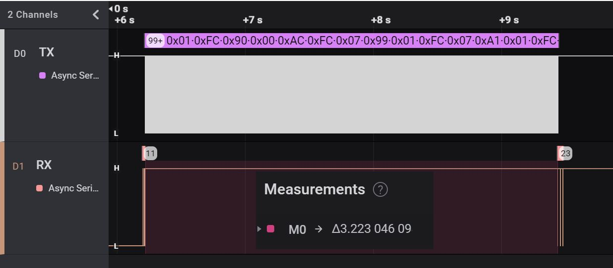

**NOTE**

For booting from 2-wire UART when using the [DA14531] module would require the **secondary booter** in order to divert the TX/RX functionality to other pins since **P01** is not exposed in the module.

**Program Custom image:**

If you want to program your own image you have to convert the hex file to a comma separated format in an array similar `da14531_codeless_image.h`, for this you can run the **hex2array**
available in this [gitHub repo](https://github.com/meriororen/hex2array).

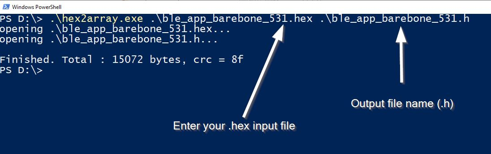

## Expected Result

After about 5 seconds when the run button is pressed the DA14531 should start advertising itself as **Codeless** (this is the standard advertising name for Codeless project). 
Down below a screenshot can be seen from the LightBlue® after the boot was successful.

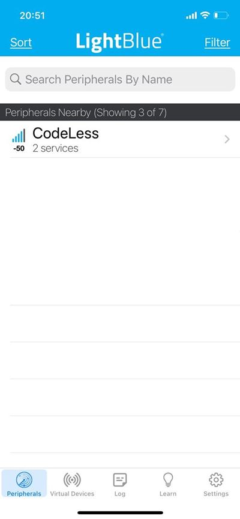

## Known Limitations

- There are No known limitations for this example. But you can check and refer to: 

	- [SDK6 Known Limitations](http://lpccs-docs.dialog-semiconductor.com/sdk6_kll/index.html).
	- [known hardware limitations for DA14531 devices](https://www.dialog-semiconductor.com/da14531_HW_Limitation).
	- [DA14531 Getting Started guide](https://www.dialog-semiconductor.com/da14531-getting-started).
	- [Dialog BLE Support Forum](https://www.dialog-semiconductor.com/BLE_Support).