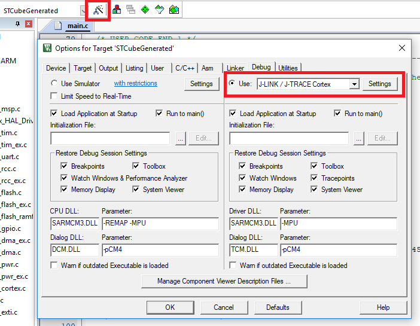
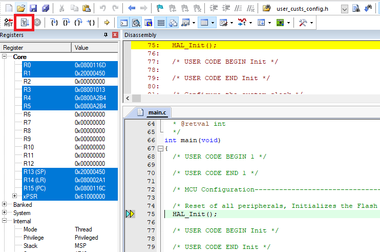
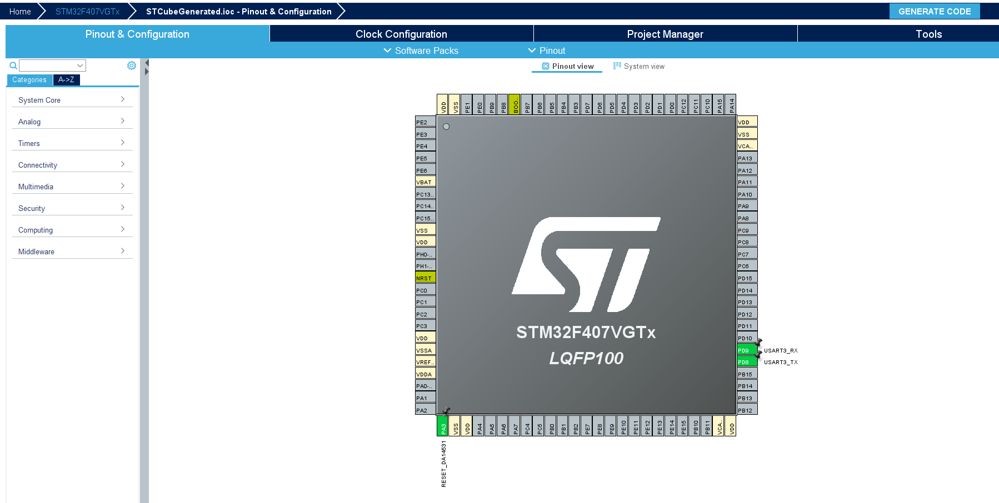

# Booting the DA14531 with Codeless through a STM32

---

## Example description

The DA14531 has an integrated ARM Cortex M0+ and can be used for programming and controlling the SoC. Due to the small form factor the ARM Cortex has its limitations. A solution for the limitations of the integrated microprocessor can be to use an external microprocessor. To control the DA14531 with this microprocessor some code is still needed on the DA14531. Fortunately, the DA14531 can execute code from RAM that can be loaded in during its boot sequence. This way a microcontroller can load a program onto the DA14531.

The goal of this example is to show how to load a program into the RAM of the DA14531 via a STM32 microcontroller. This example shows the flow of the code and how it can be configured. The program that is booted on the DA14531 in this example is called Codeless. The interface that is used for booting Codeless is UART. Codeless is a solution by Dialog to interface with the DA14531 with AT commands. More info on Codeless and its use can be found on [here](https://www.dialog-semiconductor.com/products/smartbond-codeless-commands). In this example it will only be used to verify that the program has loaded correctly.

## HW and SW configuration

### Required hardware

- A pc workstation
- Clicker 2 for STM32 development board by MikroE
- A DA14531 Clickboard (BLE TINY click) which is already programmed with the secondary bootloader in the OTP.
- SEGGER J-Link
- (optional) DA14531 Development Kit Pro Motherboard
### Hardware configuration using the Clicker 2 for STM32 and the MikroE BLE TINY click

- Connect the J-Link Segger to the Clicker 2 for STM32 J-TAG header using SWD configuration
- Put the DA14531 Clickboard in the second MikroBUS slot of the Clicker 2 for STM32 (slot 1 can be used, but changes have to be made to the code configuration. This is explained further on in this document)

### Software configuration

**This example requires:**

- Keil 5
- **SEGGER’s J-Link** tools should be downloaded and installed.
- BLE scanner for your smartphone (in this example BLE Scanner for Android is used)

**Flow of the code**

**Running the code**

Open the Keil project file located in **project_environment/MDK-ARM** folder and once it has opened click the **Options for target...** Button. In this screen go to Debug and set the debugger to **J-LINK / J-TRACE Cortex**
After setting the debugger click on the **Settings** Button. Within this screen select the J-link module that is connected and set the **Port:** to **SW**. Save these settings.

After all the settings have been set the project can be built. Press the **Build** button or the **F7** key to start building the project.
When the build is done press the **Start/Stop Debug Session** button or the key combination **Ctrl + F5** to load to program into the STM32.

In the debug screen press the **Run** button or the **F5** key to start the program and the boot process should start.

## Expected Result

After about 5 seconds when the run button is pressed the DA14531 should start advertising itself as **Codeless** (this is the standard advertising name for Codeless). Down below a screenshot can be seen from BLE scanner for Android after the boot was successful.

## Code settings

The booting process has two options 1 wire UART and 2 wire UART, in this example the booting process is done through 2 wire UART. This can be configured by either passing _TWO\_WIRE_ or _ONE\_WIRE_ to the booting function.

Another important parameter of the boot function is the CRC parameter. The CRC is to check whether the code received by the DA14531 is correct. It is calculated with the _crc_calculate_ function and passed to the boot function.

Within the boot_config.h file two settings can be found. The BOOT_ATTEMPTS and TIMEOUT_TIME define these settings. The BOOT_ATTEMPTS dictates how many attempts should be taken to start the booting process. The TIMEOUT_TIME defines the amount of time the UART should wait before a byte as received, this is a blocking process.

## Side Notes

The project is setup using STM32CubeMX and the .ioc is provided with the project so changes can be made should they be necessary for the user. The settings used in STM32CubeMX are as follows:

As an example, the UART pins can be changed to pins **PD5** and **PD6** to use the first MikroBUS slot. Keep in mind that the UART handle changes in the code and that the correct one should be passed to the boot function.

## Known Limitations

- Refer to the following application note for DA14531 known [hardware limitations](https://www.dialog-semiconductor.com/da14531_HW_Limitation)
- Also refer to Dialog Software [Forum Link](https://support.dialog-semiconductor.com/forum)

