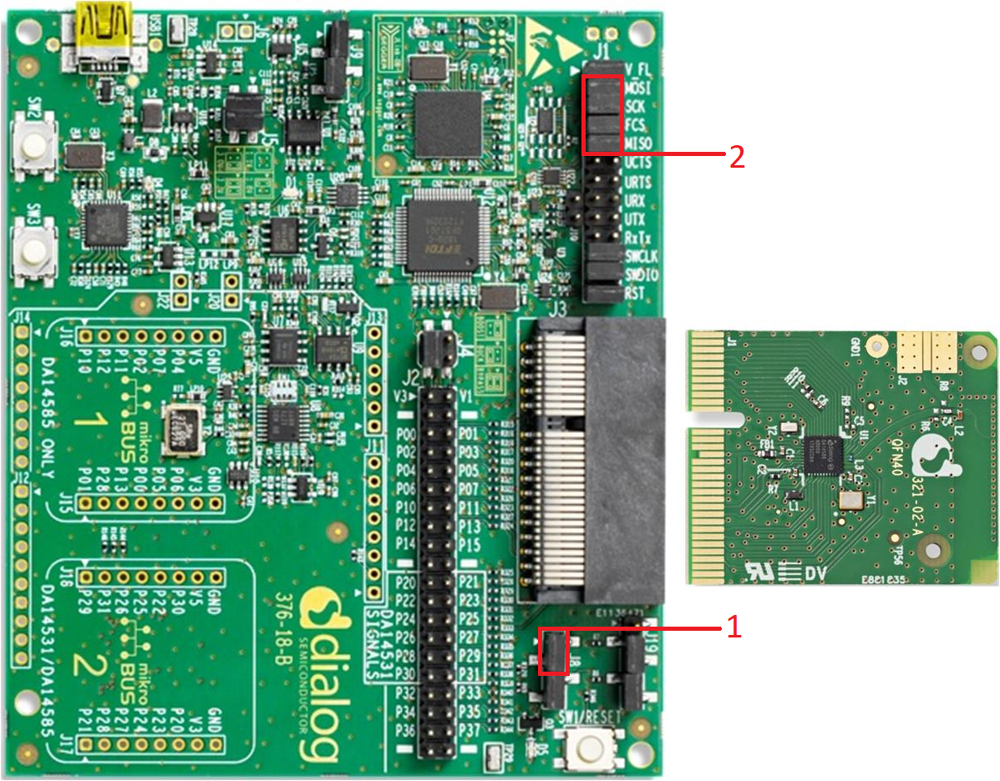
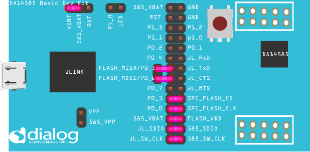


# SPI reading and writing using DMA, monitored by SmartSnippets Toolbox

---

## Example description

This example demonstrates:
  - How to send SPI messages using DMA (Direct Memory Access)
  - How to read __Flash__ using SPI with DMA
  - If CFG_SPI_DMA_SUPPORT (defined by default in this example) is undefined this example uses SPI without DMA
  - To see the power consumption SmartSnippets Toolbox is used.
    - To know when the SPI demo starts a cursor is set in SmartSnippets Toolbox 
   	
## HW and SW configuration

**Hardware configuration**

This example runs on the BLE Smart SoC (System on Chip) devices:
- DA14585/DA14586 or DA14531 daughter board + DA145xxDEVKT-P PRO-Motherboard.
- DA14585/DA14586 Basic Development Kit.

The user manuals for the development kits can be found:
- [here](https://www.dialog-semiconductor.com/products/da14531-development-kit-pro) for the DA145xxDEVKT-P PRO-Motherboard.
- [here](https://www.dialog-semiconductor.com/sites/default/files/um-b-048_da14585da14586_getting_started_guide_v2.0_0.pdf) for the Basic Development Kit.

* __Hardware configuration DA14531 using DA145xxDEVKT-P PRO-Motherboard__
- Connect, on J2, P29 to P13, as shown in the image below (orange line).
- Connect, on J8, P1_3 to C_TRIG, red box 1.
- Connect on J1: MOSI, SCK, FCS and MISO as shown in the image below (red box 2).

* __Hardware configuration DA14585 using the DA145xxDEVKT-P PRO-Motherboard__
- Connect, on J8, P1_3 to C_TRIG, red box 1.
- Connect on J1: MOSI, SCK, FCS and MISO as shown in the image below (red box 2).

* __Hardware configuration DA14585 using the basic development kit__
- Configure the development kit for SPI as shown in the image below.

 **Software configuration**

This example requires:
- [SDK6.0.12](https://www.dialog-semiconductor.com/da14531_sdk_latest).
- Keil5.
- __SEGGER’s J-Link__ tools should be downloaded and installed.
- [SmartSnippets Toolbox v5.0.10](http://lpccs-docs.dialog-semiconductor.com/SmartSnippetsToolbox5.0.8_UM/index.html)

## How to run the example
### Setup
Before launching the Keil project, make sure to link the SDK and project environment using the Python linker script `dlg_make_keil_vx.xxx`. More information [here](http://lpccs-docs.dialog-semiconductor.com/Software_Example_Setup/index.html).
1. Start Keil using the `SPI_DMA_example.uvprojx` Keil project file.

2. Expand the dialog shown in the red box in the image below.

3. Select your device: DA14531, DA14586 or DA14585.
		

4. (Optional) Change configurations in: *user_spi.h*, *user_periph_setup.h*

5. (Optional) attach logic analyzer.

6. Attach [SmartSnippets toolbox](https://s3.eu-west-2.amazonaws.com/lpccs-docs.dialog-semiconductor.com/SmartSnippetsToolbox5.0.8_UM/index.html) 

7. Compile (F7) and launch (ctrl + F5) the example.\
If the warning (shown below) pops up press OK.
 

## Expected Results

Logic analyzer result:

SmartSnippets Toolbox capture, the vertical red line is the cursor set by *arch_set_pxact_gpio* in *demo_spi*

## About this example 

To use SPI without DMA:
-  Project -> Options for Target 'Your device, for example: DA14531' -> c/c++ and in the Preprocessor Symbols remove \"CFG_SPI_DMA_SUPPORT\"

Important notes:
- After a DMA transaction it is important to wait while the DMA rx or tx channel is busy, this is done by *wait_for_DMA*.
- __TEST_SIZE__ is defined in *user_spi.h* and is the size of the buffer received and transmit.

## Troubleshooting
- Please check that the steps according to your daughter board (DA14531, DA14585 or DA14586) and mother board (basic development kit or DA145xxDEVKT-P PRO-Motherboard) are followed correctly.

- Try a different USB1 cable.

- Try different jumper wire, if used.

- If there are problems with SmartSnippets Toolbox the user manual can be found [here](http://lpccs-docs.dialog-semiconductor.com/SmartSnippetsToolbox5.0.8_UM/index.html)
- If none of the above points help, please check the user manual according to your daughter board and mother board. User manual can be found [here](https://www.dialog-semiconductor.com/products/da14531-development-kit-pro) for the DA145xxDEVKT-P PRO-Motherboard and [here](https://www.dialog-semiconductor.com/sites/default/files/um-b-048_da14585da14586_getting_started_guide_v2.0_0.pdf) for the Basic Development Kit.

