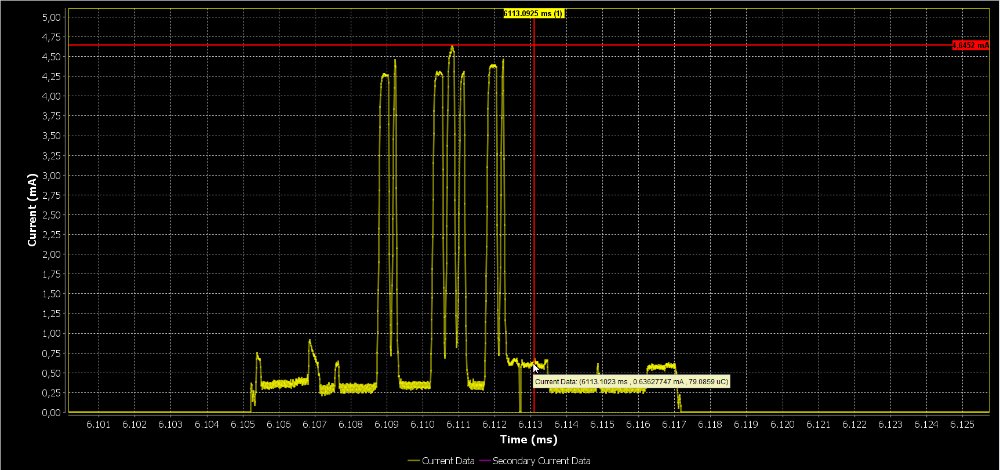

# DA14585/DA14586 Scan Tracking peripheral

---

## Example description

This SDK6 DA14585 example shows how a peripheral device can track if it is scanned and which central device 
performs the scanning procedure.
The scan device needs to scan in active mode since the peripheral device will track if it is scanned using
the scan request that the central will issue to get the scan response data from the peripheral.
The example Requires a minor change in the SDK code, the scan request is tracked in every BLE end event,
the user will have to attach a hook in the BLE end event ISR.
	
## HW and SW configuration

* **Hardware configuration**

	- This example runs on The DA14585/DA14586 Bluetooth Smart SoC devices.
	- The Basic / Pro Development kit is needed for this example.
	- Connect the USB Development kit to the host computer.
	- UART TX jumper on P0_4

* **Software configuration**

	- This example requires:
    * Smartsnippets Studio 1.6.3.
    * SDK6.0.10
	- **SEGGER’s J-Link** tools should be downloaded and installed.
	- **A simple serial terminal** should be installed on the PC

## How to run the example

For initial setup of the example please refer to [this section of the dialog support portal](https://support.dialog-semiconductor.com/resource/da1458x-example-setup).

### Initial Setup

 - Start Keil
 - Open file rwble.c
 - Search for the dlg_event_isr() function (line 700)
 - Above dlg_event_isr() function implementation, add the declaration of the hook function "__weak void user_end_event_isr_hook(void) {}"
 - In the dlg_event_isr() function invoke the user_end_event_isr_hook() function before any other SDK function is invoked.
 - Compile and launch the example
 - Open the development kit serial port with the following parameters

		- baudrate: 115200
		- data: 8 bits
		- stop: 1 bit
		- parity: None
		- flow  control: none
 - If the device is activelly scanned then the fw will print the bd addresses that are scanning the device.
 - Also in the case of a scan request a cursor will also appear in the power profiler of Smart Snippets.

	
	

## Known Limitations

- There are No known limitations for this example. But you can check and refer to the following application note for
[known hardware limitations](https://support.dialog-semiconductor.com/system/files/resources/DA1458x-KnownLimitations_2018_02_06.pdf "known hardware limitations").
- Dialog Software [Forum link](https://support.dialog-semiconductor.com/forums/dialog-smartbond-bluetooth-low-energy-%E2%80%93-software"Forum link").
- you can Refer also for the Troubleshooting section in the DA1585x Getting Started with the Development Kit UM-B-049.

## License

**************************************************************************************

 Copyright (c) 2018 Dialog Semiconductor. All rights reserved.

 This software ("Software") is owned by Dialog Semiconductor. By using this Software
 you agree that Dialog Semiconductor retains all intellectual property and proprietary
 rights in and to this Software and any use, reproduction, disclosure or distribution
 of the Software without express written permission or a license agreement from Dialog
 Semiconductor is strictly prohibited. This Software is solely for use on or in
 conjunction with Dialog Semiconductor products.

 EXCEPT AS OTHERWISE PROVIDED IN A LICENSE AGREEMENT BETWEEN THE PARTIES OR AS
 REQUIRED BY LAW, THE SOFTWARE IS PROVIDED "AS IS", WITHOUT WARRANTY OF ANY KIND,
 EXPRESS OR IMPLIED, INCLUDING BUT NOT LIMITED TO THE WARRANTIES OF MERCHANTABILITY,
 FITNESS FOR A PARTICULAR PURPOSE AND NON-INFRINGEMENT. EXCEPT AS OTHERWISE PROVIDED
 IN A LICENSE AGREEMENT BETWEEN THE PARTIES OR BY LAW, IN NO EVENT SHALL DIALOG
 SEMICONDUCTOR BE LIABLE FOR ANY DIRECT, SPECIAL, INDIRECT, INCIDENTAL, OR
 CONSEQUENTIAL DAMAGES, OR ANY DAMAGES WHATSOEVER RESULTING FROM LOSS OF USE, DATA OR
 PROFITS, WHETHER IN AN ACTION OF CONTRACT, NEGLIGENCE OR OTHER TORTIOUS ACTION,
 ARISING OUT OF OR IN CONNECTION WITH THE USE OR PERFORMANCE OF THE SOFTWARE.

**************************************************************************************
