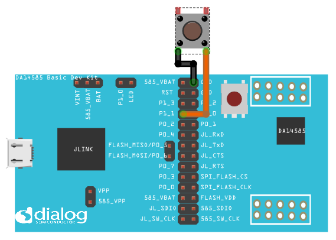
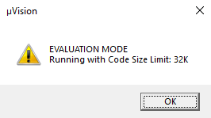

# DA14585/DA14586/DA14531 Peripheral GPIO - Simple Button press

---


## Example description

This example shows:
How to configure a button for
- Short press (< 3 seconds)
- Long press (>= 3 seconds)

The expected result of the example can be verified by:
- Connecting a serial terminal to the work station to the MB (Mother Board) using UART
- Means of a blinkign LED.

## HW and SW configuration
This example runs on the BLE Smart SoC (System on Chip) devices:
- DA14585/DA14586 & DA14531 daughter board + Pro Dev Kit mother board.
- DA14585/DA14586 daughter board + Basic Dev Kit mother board.

The user manuals for the development kits can be found:
- [here](https://www.dialog-semiconductor.com/products/da14531-development-kit-pro) for the Pro Development Kit.
- [here](https://www.dialog-semiconductor.com/sites/default/files/um-b-048_da14585da14586_getting_started_guide_v2.0_0.pdf) for the Basic Development Kit.

* __Hardware configuration DA14531 using Pro Development Kit__

	- UART TX: connect P21 on J2 to UTX pin 17 on J1 as shown in the image below (the blue line)
	- LED jumper is configured to P1_0 (red box 2)
	- Button jumper is configured from SW2 pin to P3_1 (red box 1)
	- Connect the USB Development kit to the host computer.

	The image below shows the Motherboard with jumper (wire) configuration for the DA14531.

	
		
* __Hardware configuration DA14585 using the Pro Development Kit__

	- UART TX jumper on P0_4 (red box 1)
	- LED jumper is configured to P1_0 (red box 3)
	- Button jumper is configured from SW3 pin to P1_1 (red box 2)
	- Connect the USB Development kit to the host computer.

	The image below shows the Motherboard with jumper configuration for the DA14585

	

* __Hardware configuration DA14585 using the Basic Development Kit__

	- UART TX/RX jumper on P0_4/P0_5
	- LED jumper is configured to P10
	- An active-low switch should be connected to P1_1 as displayed in the following schematic
	- Connect the USB Development kit to the host computer.

	

* __Software configuration__
This example requires:
	- (SDK6.0.12)[!!! SDK LINK !!!]
	- Keil5
	- __SEGGER’s J-Link__ tools should be downloaded and installed.
	- Serial Terminal software. For example Tera Term or PuTTY.

## How to run the example
### Setup
Before launching the Keil project, make sure to link the SDK and project environment using the Python linker script `dlg_make_keil_vx.xxx`. More information [here](https://www.dialog-semiconductor.com/sites/default/files/sw-example-da145x-example-setup.pdf).
1. Start Keil using the `simple_button.uvprojx` Keil project file.
 
2. Expand the dialog shown in the red box in the image below.


3. Select your device: DA14531, DA14586 or DA14585.
		


4. Open a serial terminal on the work station using for example Tera Term/PuTTY with the following parameters:
```
- baudrate: 115200
- data: 8 bits
- stop: 1 bit
- parity: None
- flow  control: none
```

5. Compile (F7) and launch (ctrl + F5) the example.\
If the warning (shown below) pops up press OK.
 


6. A screen similar to the image below is shown.\
Press F5 to run the example.


## Expected Results
The button interrupt with edge detection example is now running. Following the following steps shows it works as intended:

1. With a serial UART monitor open on the work station, press the button (depending on the DB) and check the results in the window.

- Pressing the button (SW3 for the DA14585 and SW2 for the DA14531) for less than 3 seconds (i.e. short press) to toggle the led status
- Pressing the button (SW3 for the DA14585 and SW2 for the DA14531) for 3 seconds or more (i.e. long press) will start LED blinking ON/OFF
- Pressing the button (SW3 for the DA14585 and SW2 for the DA14531) for less than 3 seconds (i.e. short press) again will stop LED blinking or toggle the led status

### DA14585/DA14586/DA14531 with Pro Dev Kit
1. Identify LED `D5` on the Pro Dev Kit, colored `orange`.
2. Have the serial UART monitor active: status messages will be displayed here as shown in the following. See step `4` in ["How to run the example"](#How-to-run-the-example) for setting up the serial monitor.

2. Identify button:
	- DA14531 uses `SW2` as button in this example
	- DA14585/DA14586 uses `SW3` as button in this example
2. Pressing the button for less than 3 seconds (= short press):
	- Toggles the LED status.
	- Sends a message to the serial terminal indicating the LED should be on. 
3. Pressing the button for 3 or more seconds (= long press):
	- Start toggling the LED status with a set interval (software configured).
	- Sends messages to the serial terminal indicating the LED should be blinking.
4. Pressing the button again:
	- Stops LED blinking.

### DA14585/DA14586 Basic Dev Kit
1. Identify LED `USR` on the Pro Dev Kit, colored `green`.

## Troubleshooting
Did you follow the steps above?
No? Check cables and USB ports.
Still no? Dialog forum(s).

## License


**************************************************************************************

 Copyright (c) 2019 Dialog Semiconductor. All rights reserved.

 This software ("Software") is owned by Dialog Semiconductor. By using this Software
 you agree that Dialog Semiconductor retains all intellectual property and proprietary
 rights in and to this Software and any use, reproduction, disclosure or distribution
 of the Software without express written permission or a license agreement from Dialog
 Semiconductor is strictly prohibited. This Software is solely for use on or in
 conjunction with Dialog Semiconductor products.

 EXCEPT AS OTHERWISE PROVIDED IN A LICENSE AGREEMENT BETWEEN THE PARTIES OR AS
 REQUIRED BY LAW, THE SOFTWARE IS PROVIDED "AS IS", WITHOUT WARRANTY OF ANY KIND,
 EXPRESS OR IMPLIED, INCLUDING BUT NOT LIMITED TO THE WARRANTIES OF MERCHANTABILITY,
 FITNESS FOR A PARTICULAR PURPOSE AND NON-INFRINGEMENT. EXCEPT AS OTHERWISE PROVIDED
 IN A LICENSE AGREEMENT BETWEEN THE PARTIES OR BY LAW, IN NO EVENT SHALL DIALOG
 SEMICONDUCTOR BE LIABLE FOR ANY DIRECT, SPECIAL, INDIRECT, INCIDENTAL, OR
 CONSEQUENTIAL DAMAGES, OR ANY DAMAGES WHATSOEVER RESULTING FROM LOSS OF USE, DATA OR
 PROFITS, WHETHER IN AN ACTION OF CONTRACT, NEGLIGENCE OR OTHER TORTIOUS ACTION,
 ARISING OUT OF OR IN CONNECTION WITH THE USE OR PERFORMANCE OF THE SOFTWARE.

**************************************************************************************
