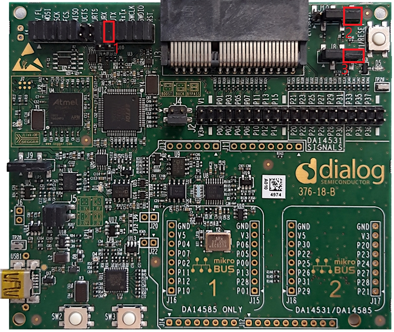
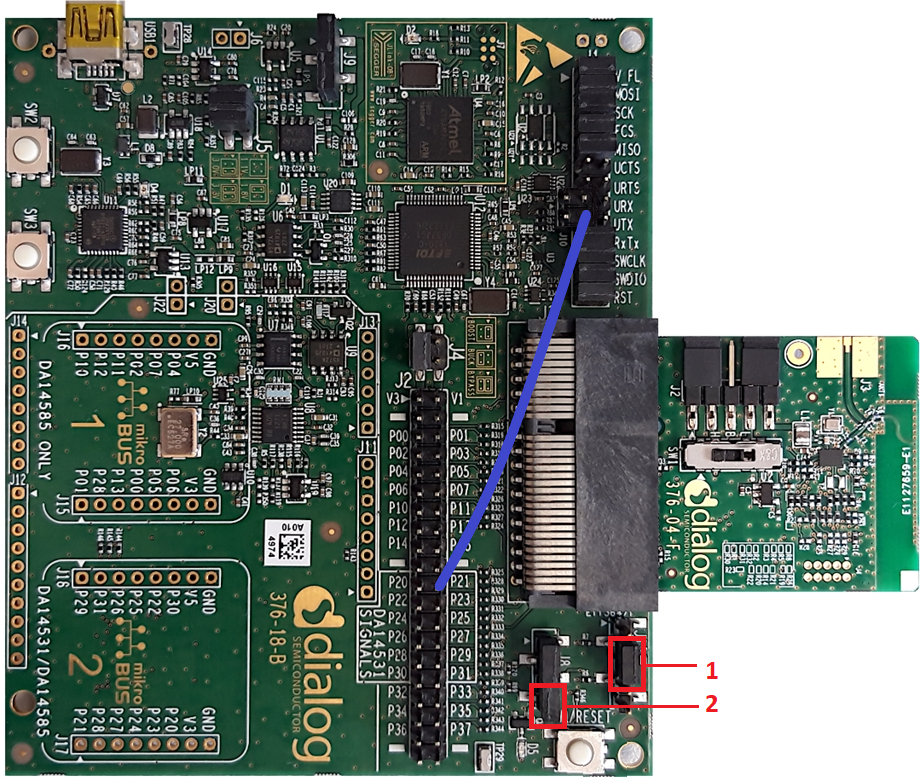

# DA14585/DA14586/DA14531 Peripheral GPIO - Simple Button press

---

## Example description

This SDK6 example shows how configure a simple button for short press and long press (>3 seconds)
from the applicaiton layer.
As a proof of concept it can be verified by transmitting UART messages or the LED status

## HW and SW configuration

	-This example runs on The DA14585 and the 14531 Bluetooth Smart SoC devices.	
	-The Basic / Pro Development kit is needed for this example.
	Follow the hardware configuration according to your Daughterboard, DA14585 or DA14531.

* **Hardware configuration DA14585**

	- Connect the USB Development kit to the host computer.
	- UART TX/RX jumper on P0_4/P0_5 (red box 1)
	- LED jumper is configured to P1_0 (red box 2)
	- Button jumper is configured to P1_1 (red box 3) redcorresponding to SW3 on the Pro Development kit.
	  The image below shows the Motherboard with jumper configuration for the DA14585

		

* **Hardware configuration DA14531**

	- Connect the USB Development kit to the host computer.
	- UART TX jumper wire from P26 on J2 to UTX pin 17 on J1 as shown in the image below (the green line)
	- LED jumper is configured to P1_0 (red bow 1)
	- Button jumper is configured to P1_1 (red box 2) redcorresponding to SW3 on the Pro Development kit.
	  The image below shows the Motherboard with jumper (wire) configuration for the DA14531

		

* **Software configuration**

	- This example requires:
    * Smartsnippets Studio 1.6.3.
    * SDK6.0.11
	- **SEGGER’s J-Link** tools should be downloaded and installed.

## How to run the example

For initial setup of the example please refer to [this section of the dialog support portal](https://support.dialog-semiconductor.com/resource/da1458x-example-setup).

### Initial Setup

 - Start Keil
 - Select your device in the box shown below (DA14585, DA14586 or DA14531)

 - Compile and launch the example
 - Open the development kit serial port with the following parameters

		- baudrate: 115200
		- data: 8 bits
		- stop: 1 bit
		- parity: None
		- flow  control: none

 - Pressing the button (P1_1) for less than 3 seconds (i.e. short press) to toggle the led status
 - Pressing the button (P1_1) for 3 seconds or more (i.e. long press) will start LED blinking ON/OFF
 - Pressing the button (P1_1) for less than 3 seconds (i.e. short press) again will stop LED blinking or toggle

	

## Known Limitations

- There are No known limitations for this example. But you can check and refer to the following application note for
[known hardware limitations](https://support.dialog-semiconductor.com/system/files/resources/DA1458x-KnownLimitations_2018_02_06.pdf "known hardware limitations").
- Dialog Software [Forum link](https://support.dialog-semiconductor.com/forums).
- you can Refer also for the Troubleshooting section in the DA1585x Getting Started with the Development Kit UM-B-049.

## License

**************************************************************************************

 Copyright (c) 2019 Dialog Semiconductor. All rights reserved.

 This software ("Software") is owned by Dialog Semiconductor. By using this Software
 you agree that Dialog Semiconductor retains all intellectual property and proprietary
 rights in and to this Software and any use, reproduction, disclosure or distribution
 of the Software without express written permission or a license agreement from Dialog
 Semiconductor is strictly prohibited. This Software is solely for use on or in
 conjunction with Dialog Semiconductor products.

 EXCEPT AS OTHERWISE PROVIDED IN A LICENSE AGREEMENT BETWEEN THE PARTIES OR AS
 REQUIRED BY LAW, THE SOFTWARE IS PROVIDED "AS IS", WITHOUT WARRANTY OF ANY KIND,
 EXPRESS OR IMPLIED, INCLUDING BUT NOT LIMITED TO THE WARRANTIES OF MERCHANTABILITY,
 FITNESS FOR A PARTICULAR PURPOSE AND NON-INFRINGEMENT. EXCEPT AS OTHERWISE PROVIDED
 IN A LICENSE AGREEMENT BETWEEN THE PARTIES OR BY LAW, IN NO EVENT SHALL DIALOG
 SEMICONDUCTOR BE LIABLE FOR ANY DIRECT, SPECIAL, INDIRECT, INCIDENTAL, OR
 CONSEQUENTIAL DAMAGES, OR ANY DAMAGES WHATSOEVER RESULTING FROM LOSS OF USE, DATA OR
 PROFITS, WHETHER IN AN ACTION OF CONTRACT, NEGLIGENCE OR OTHER TORTIOUS ACTION,
 ARISING OUT OF OR IN CONNECTION WITH THE USE OR PERFORMANCE OF THE SOFTWARE.

**************************************************************************************
